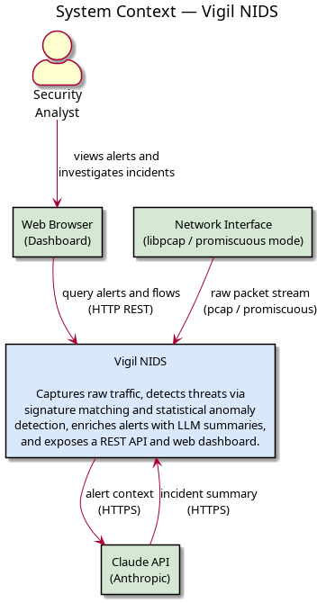
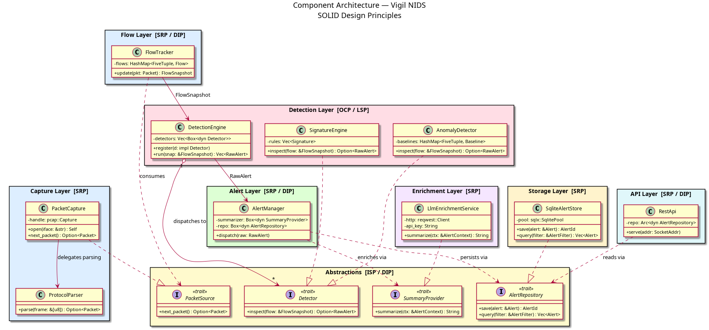
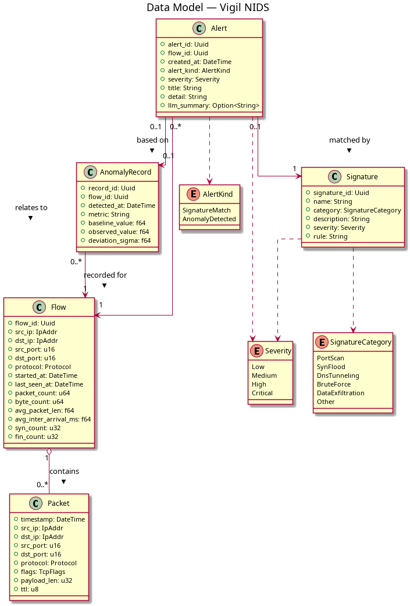
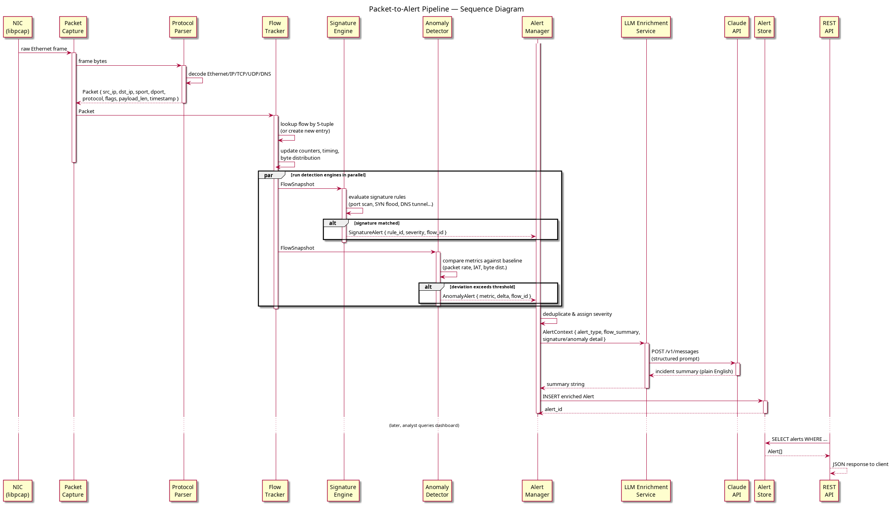
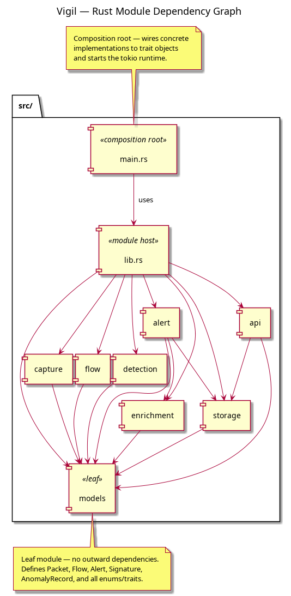
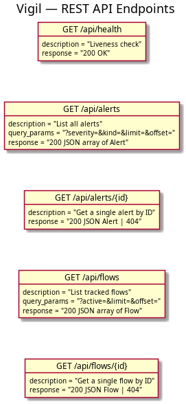

# vigil

A network intrusion detection system (NIDS) built in Rust. Vigil monitors live network traffic, detects suspicious behavior through signature-based rules and statistical anomaly detection, and uses an LLM to generate plain-English explanations of security incidents.

## What it does

Vigil captures raw packets off a network interface, groups them into flows, and runs them through two detection layers:

- **Signatures** — rule-based detection for known attack patterns (port scans, SYN floods, DNS tunneling, etc.)
- **Anomaly detection** — statistical baselining per flow; deviations from normal behavior are flagged

When an alert is triggered, vigil calls an LLM API to produce a human-readable incident summary explaining what happened, why it's suspicious, and what to do about it.

Alerts are persisted to a local database and exposed through a REST API, with a web dashboard for real-time visibility.

## How Vigil Works

Vigil is a passive NIDS — it observes traffic without injecting or modifying packets. It binds to a network interface in promiscuous mode via libpcap and processes every frame it sees.

### Capture & Flow Assembly

Raw Ethernet frames are decoded through the standard layer stack (Ethernet → IP → TCP/UDP/DNS). Each decoded packet is assigned to a **flow** — a bidirectional conversation identified by the classic 5-tuple (src IP, dst IP, src port, dst port, protocol). Flows accumulate packet counts, byte totals, timing deltas, and payload size distributions over their lifetime.

This is similar to how NetFlow/IPFIX works at the collector level, except Vigil builds flows from raw packets rather than receiving pre-aggregated records from a router. That means it has access to per-packet detail (TCP flags, payload lengths, inter-arrival times) that flow exporters typically discard.

### Detection

Every flow is evaluated by two independent detection layers:

- **Signature engine** — pattern-matching rules that fire on known indicators. Examples: a single source hitting N distinct destination ports in a window (port scan), a burst of SYN packets with no corresponding ACKs (SYN flood), abnormally long DNS TXT queries to a single domain (DNS tunneling). These are deterministic — if the rule matches, an alert fires.

- **Anomaly detector** — statistical baselining per flow. Vigil tracks running metrics (packets/sec, bytes/sec, payload size mean/variance) and flags when observed values deviate beyond a configurable sigma threshold. This catches things signatures can't: a slow data exfiltration that stays under rate-limit thresholds, or a protocol behaving normally in structure but abnormally in volume.

Both layers run against a point-in-time **flow snapshot**, so detection never blocks or stalls the capture path.

### What it sees (and doesn't)

Vigil operates on **unencrypted packet headers and metadata**. For TLS-encrypted traffic, it can observe connection setup (TCP handshake, TLS ClientHello/SNI), flow-level statistics (timing, volume, directionality), and DNS queries if they happen in the clear — but not payload content. This is consistent with how most network-level IDS tools operate; deep packet inspection of encrypted streams is out of scope.

For full visibility on a switched network, Vigil should be deployed on a SPAN/mirror port or network tap. On the host itself, binding to `lo` or a specific interface works for monitoring traffic to/from that machine. It requires root (or `CAP_NET_RAW`) because libpcap needs raw socket access.

### Alert Enrichment

When either detector fires, the raw alert (flow metadata, detection reason, matched rule or deviation stats) is sent to the Claude API. The LLM returns a plain-English summary: what happened, why it's suspicious in context, and suggested next steps. This is optional — Vigil functions without an API key, you just won't get the narrative summaries.

Alerts are persisted to SQLite and queryable through the REST API.

## Why

Most intrusion detection tools rely entirely on static signatures — they can only catch attacks they've seen before. Vigil pairs signature matching with behavioral baselines, so novel or low-and-slow attacks that don't match any known rule can still surface as anomalies.

The LLM layer bridges the gap between raw alert data and actionable insight, making the tool useful to someone without deep packet analysis experience.

## Stack

- **Rust** — packet capture, protocol parsing, detection engine, API server
- **pcap / pnet** — raw packet capture and protocol decoding
- **tokio + axum** — async runtime and HTTP API
- **sqlx + SQLite** — alert and flow storage
- **Claude API** — LLM-powered incident summaries

## Architecture

### System context



Vigil sits between the raw network and the analyst. It reads a continuous packet stream off the NIC in promiscuous mode, runs detection, calls the Claude API over HTTPS to enrich alerts, and serves a REST API that the web dashboard queries.

### Components



The codebase is split into focused layers, each with a single responsibility. Cross-layer dependencies point at traits rather than concrete types, so each layer can be tested in isolation and new detectors or storage backends can be registered without touching existing code.

| Layer | Responsibility |
|---|---|
| **Capture** | Opens the NIC via libpcap and decodes Ethernet/IP/TCP/UDP/DNS frames into typed `Packet` values |
| **Flow** | Groups packets by 5-tuple into bidirectional `Flow` records, tracking counters, timing, and byte distribution |
| **Detection** | Runs every registered `Detector` against each `FlowSnapshot`; ships with `SignatureEngine` (rule matching) and `AnomalyDetector` (statistical baselining) |
| **Alert** | Deduplicates and prioritises raw alerts, requests an LLM summary, and hands the enriched alert to storage |
| **Enrichment** | Calls the Claude API with structured alert context and returns a plain-English incident summary |
| **Storage** | Persists alerts and flows to SQLite via sqlx |
| **API** | Serves the REST API over axum; reads from storage through the `AlertRepository` trait |

The key abstractions are four traits defined in the `Abstractions` layer:

- `PacketSource` — anything that yields packets (real NIC or a pcap replay file)
- `Detector` — anything that can inspect a `FlowSnapshot` and optionally emit a `RawAlert`
- `SummaryProvider` — anything that can turn `AlertContext` into a string
- `AlertRepository` — anything that can save and query `Alert` records

### Data model



| Entity | Purpose |
|---|---|
| `Packet` | A single decoded frame with addressing, protocol, TCP flags, and payload length |
| `Flow` | A bidirectional conversation identified by 5-tuple, with packet/byte counters and statistical baseline fields |
| `Alert` | A confirmed threat event linked to a flow, tagged with kind (signature or anomaly) and severity, optionally enriched with an LLM summary |
| `Signature` | A named detection rule with a category, severity, and a serialised rule DSL string |
| `AnomalyRecord` | A statistical deviation record storing the baseline value, observed value, and sigma distance |

`AlertKind` is either `SignatureMatch` or `AnomalyDetected`. `Severity` runs `Low → Medium → High → Critical`. `SignatureCategory` covers `PortScan`, `SynFlood`, `DnsTunneling`, `BruteForce`, `DataExfiltration`, and `Other`.

### Packet-to-alert pipeline



1. `PacketCapture` reads a raw Ethernet frame from libpcap and hands it to `ProtocolParser`.
2. `ProtocolParser` decodes protocol layers and returns a typed `Packet`.
3. `FlowTracker` looks up (or creates) the matching flow by 5-tuple and updates counters and timing stats.
4. The `DetectionEngine` fans out to `SignatureEngine` and `AnomalyDetector` in parallel against a `FlowSnapshot`.
   - `SignatureEngine` evaluates each loaded rule; on a match it emits a `SignatureAlert`.
   - `AnomalyDetector` compares metrics against the stored baseline; if deviation exceeds the threshold it emits an `AnomalyAlert`.
5. `AlertManager` deduplicates the raw alerts and assigns final severity.
6. `LlmEnrichmentService` sends structured alert context to the Claude API and receives a plain-English incident summary.
7. The enriched `Alert` is inserted into SQLite.
8. Later, the REST API queries the store and returns alerts as JSON to the dashboard.

### Module dependency



### API endpoints



## Prerequisites

- **Rust 1.85+** — install via [rustup](https://rustup.rs)
- **libpcap-dev** — `sudo apt install libpcap-dev` (Debian/Ubuntu) or `brew install libpcap` (macOS)
- **SQLite 3** — usually pre-installed; `sudo apt install sqlite3` if needed
- **Anthropic API key** — for LLM-powered alert enrichment

## Build & Run

```bash
cargo build
```

Vigil requires raw socket access for packet capture, so it must run with elevated privileges:

```bash
sudo target/debug/vigil
```

For a release build:

```bash
cargo build --release
sudo target/release/vigil
```

## Configuration

Vigil is configured through environment variables:

| Variable | Description | Default |
|---|---|---|
| `VIGIL_INTERFACE` | Network interface to capture on | `eth0` |
| `VIGIL_DB_PATH` | Path to the SQLite database file | `vigil.db` |
| `ANTHROPIC_API_KEY` | Anthropic API key for LLM enrichment | *(required)* |
| `VIGIL_API_ADDR` | Address and port for the REST API | `127.0.0.1:3000` |
| `RUST_LOG` | Log level filter (uses `tracing-subscriber` `EnvFilter`) | `info` |

## Testing

```bash
cargo test
```

Integration tests will use pcap replay fixtures (stored in `tests/fixtures/`) to exercise the full packet-to-alert pipeline without requiring a live NIC.

## Project Status

Vigil's module structure, data model, and architecture are defined. All 8 source modules (`models`, `capture`, `flow`, `detection`, `alert`, `enrichment`, `storage`, `api`) exist but implementation is in progress. The project compiles and the test harness runs, but there is no runtime functionality yet.

## Contributing

1. Fork the repository
2. Create a feature branch (`git checkout -b feature/my-feature`)
3. Ensure code passes `cargo fmt --check` and `cargo clippy`
4. Add tests for new functionality
5. Open a pull request

## License

This project is licensed under the MIT License — see the [LICENSE](LICENSE) file for details.
